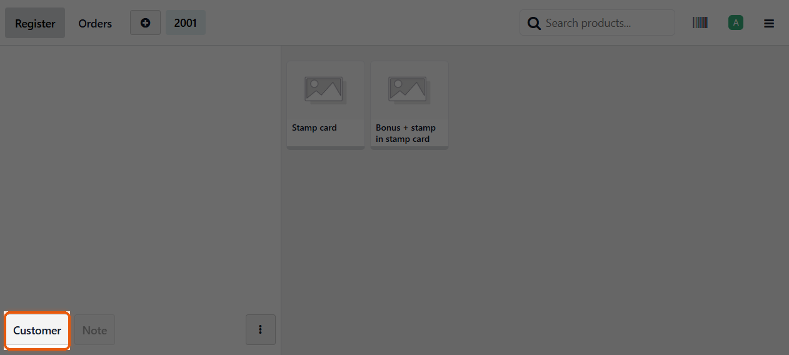
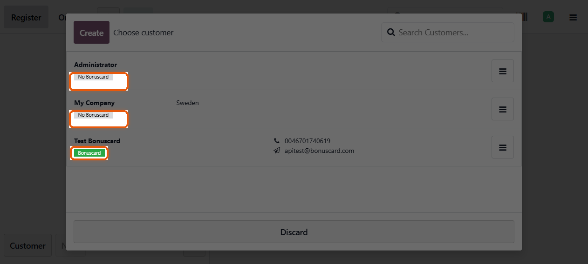
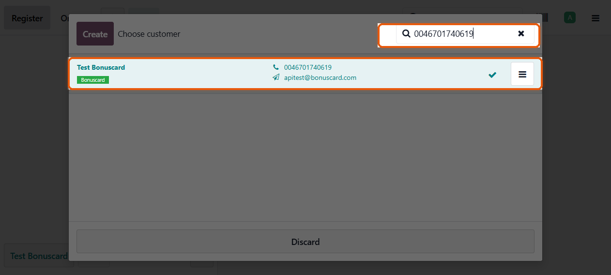
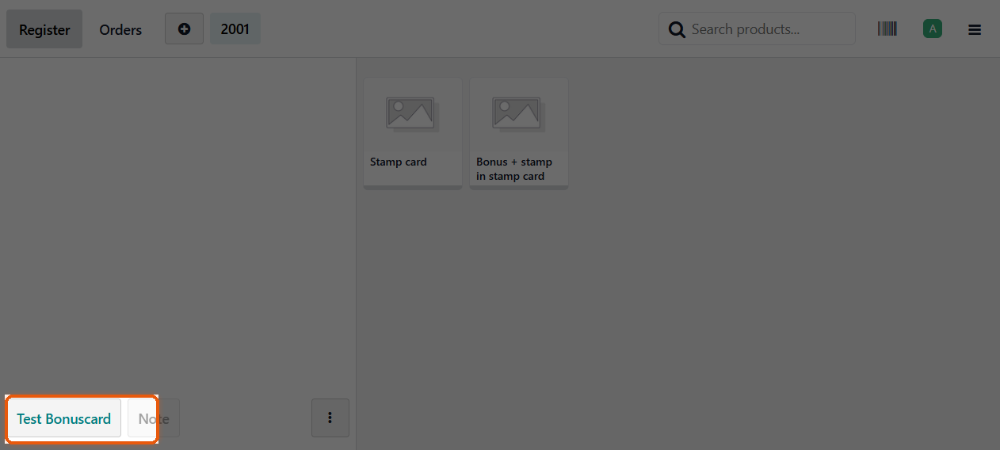
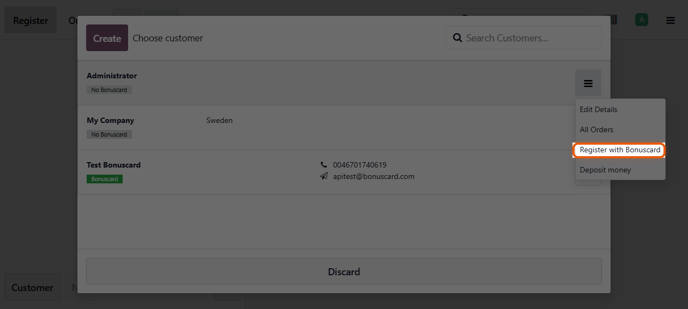
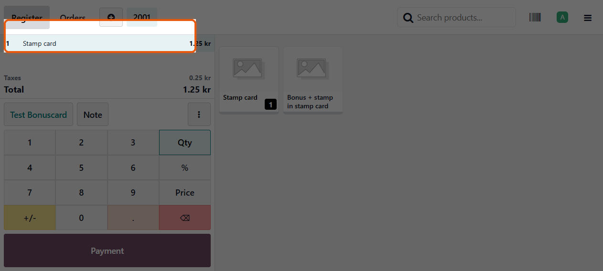
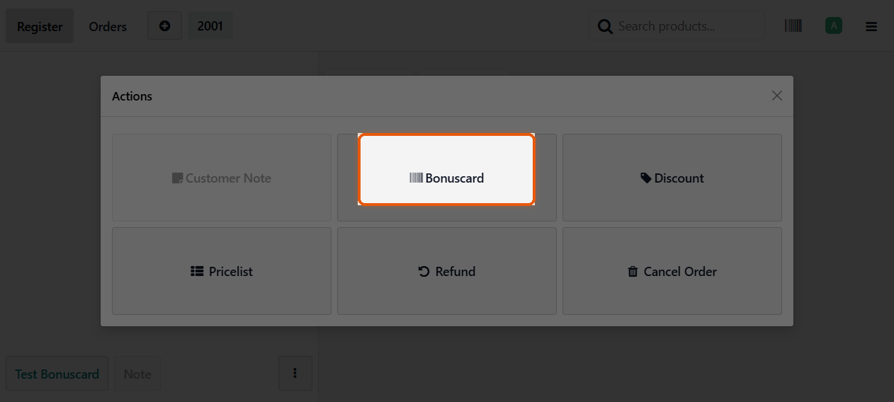
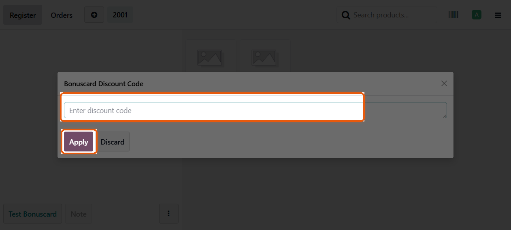

# POS cashier guide — Bonuscard

This guide is for cashiers who sell in **Point of Sale**. It covers how to
find Bonuscard customers, register new members, enter discount codes, and
complete a sale so loyalty discounts apply correctly.

Swedish version: [Kassa-guide](../sv/pos-kassor.md)

## Before you start

- You are already on the POS product screen (register open).
- A manager must already have configured the Bonuscard connection and marked
  which products belong to the Bonuscard catalog. Only catalog products take
  part in Bonuscard discounts and points; other products sell normally.
  On the product grid, catalog items show a pink Bonuscard mark in the
  top-left corner.

## 1. Find and select a Bonuscard customer

Always attach a customer to the order before you expect Bonuscard discounts.

1. Click **Customer** at the bottom of the order panel.
2. Search by name, phone, email, **Bonuscard recruitment code**, Bonuscard
   member id, or the **barcode from the Bonuscard app**.

### Status badges

| Badge | Meaning |
|-------|---------|
| **Bonuscard** (green) | Customer is linked — discounts and validation can run. |
| **No Bonuscard** (grey) | No matching Bonuscard member found for this partner. |
| **Multiple Matches** (yellow) | Bonuscard found more than one match — ask a manager to fix the link. |

### Search tip

Type a phone number, recruitment code, member id, app barcode, or email in
**Search Customers…**. If the customer is not in the local list, press
**Enter** — the POS can look them up in Bonuscard and import an exact match
(national phone numbers and app barcodes are supported; short/partial queries
are rejected).

3. Tap the customer row to select them. The order panel shows their name
   instead of **Customer**.

You may see a short success message when a linked member is detected.

## 2. Register a customer who has no Bonuscard

If the badge is **No Bonuscard** and the customer wants to join:

1. Open the customer list.
2. Open the **⋮** menu on that customer’s row.
3. Choose **Register with Bonuscard**.

The customer **must have a phone number**. On success you get a confirmation
and the status becomes linked. If registration fails, read the notification
(for example missing phone) and fix the contact details.

## 3. Sell products

Add products as usual. Bonuscard only evaluates lines that are marked **In
Bonuscard Catalog** by a manager (and that have a barcode or internal
reference).

### Spot catalog products on the grid

On the product tiles, catalog items show a small **pink Bonuscard mark** (B)
in the **top-left** corner. Products without that mark are not sent to
Bonuscard (status **Not Set** or **Not in Bonuscard Catalog**).

Long-press a product tile to open **Product Info** — the Bonuscard catalog
status badge is also shown there for single-variant products.

- Catalog products (mark visible): Bonuscard may apply discounts or
  accumulate benefits automatically after the customer is linked.
- Other products (no mark): sold normally; ignored by Bonuscard.

If a discount applies, a success toast appears and the order total updates.
Sticky warning notifications stay until you dismiss them — read them if
something failed.

## 4. Enter a Bonuscard discount code

Use this when the customer has a code (coupon / campaign code) to activate.

1. Make sure a customer is selected on the order.
2. Click the **⋮** (Actions) button next to **Note**.
3. In the **Actions** dialog, click **Bonuscard**.

4. Enter the code and click **Apply**.

What happens next:

- **Success** — the code is activated and the cart is re-checked for
  discounts.
- **Some codes** cannot be pre-registered; the POS still sends them when
  validating the purchase (you may not see a separate message for that path).
- **Errors** (wrong code, no customer, and so on) appear as sticky danger
  notifications until you dismiss them.

## 5. Take payment

Click **Payment** and finish the sale as usual.

Behind the scenes, Bonuscard finalizes the purchase when the paid order is
synced. You do not need a separate Bonuscard “confirm” step.

If finalization fails, you may see a sticky warning. Tell a manager — the
customer’s Bonuscard session may need recovery.

## 6. Cancelling or changing the order

These actions can cancel a pending Bonuscard purchase so the customer is not
left locked:

- Removing the order or starting a new one
- Closing the register
- Changing customer (cancel runs first; if cancel fails, the customer change
  is blocked)

If you see a warning that cancel failed, do **not** force another sale for
the same member until a manager has cleared it — or wait for the lock to
expire.

## Quick checklist

1. Select (or register) the customer — look for the green **Bonuscard** badge.
2. Add catalog products (pink **B** mark on the tile); watch for automatic
   discounts.
3. Optional: **Actions → Bonuscard** for a discount code.
4. Pay as usual.
5. Dismiss and act on any sticky Bonuscard warnings.

## Need help?

- Configuration and catalog setup: [module README](../../../bonuscard_odoo/README.rst)
- Technical POS flow: [POS integration explanation](../../bonuscard_pos_integration_explanation.md)
