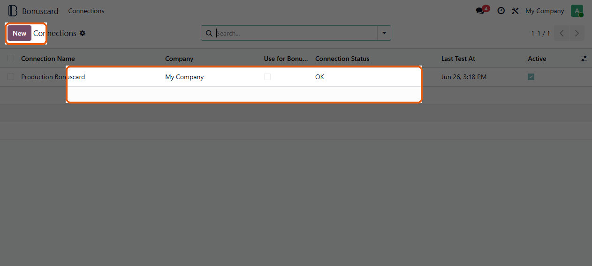
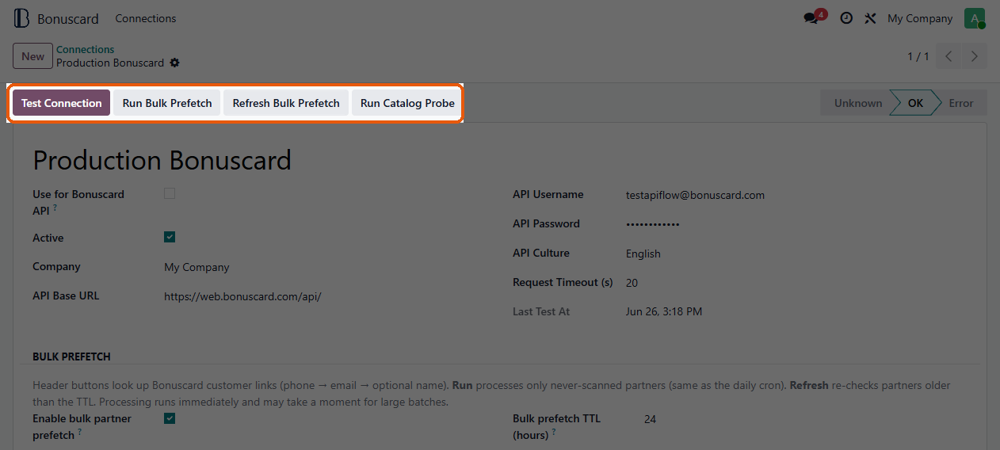
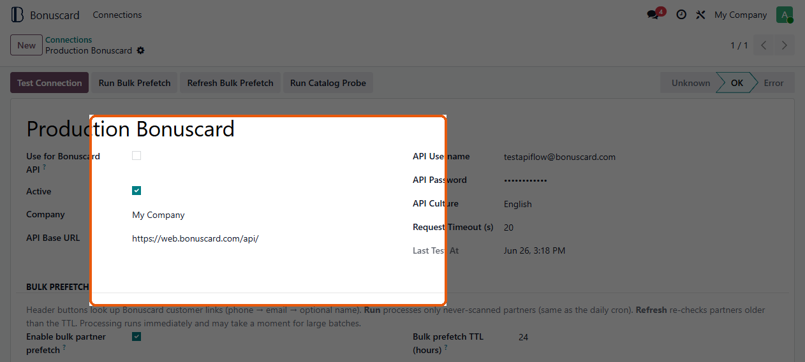
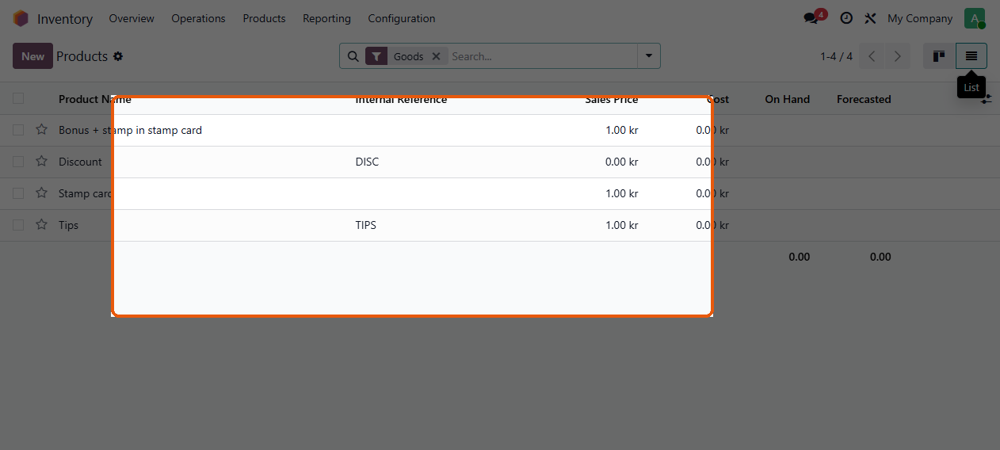
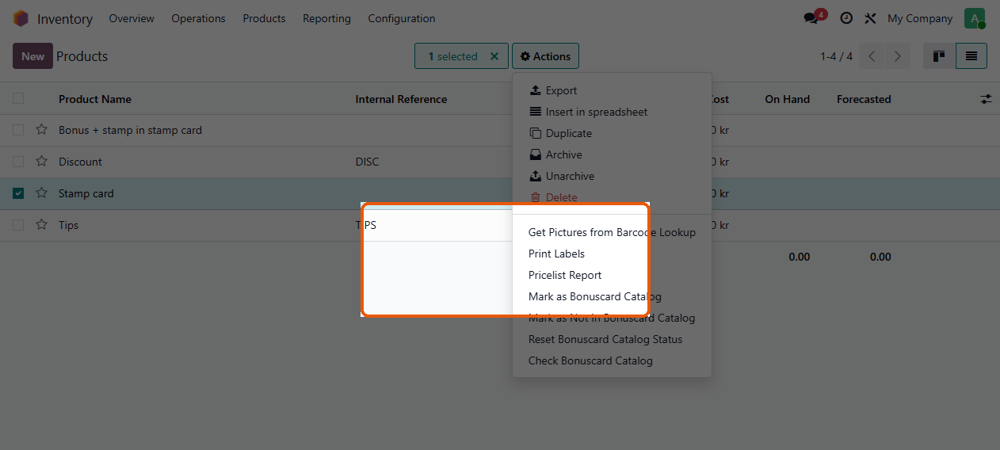
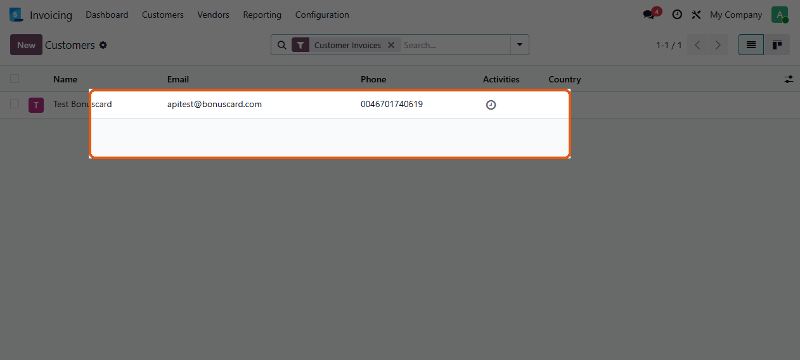
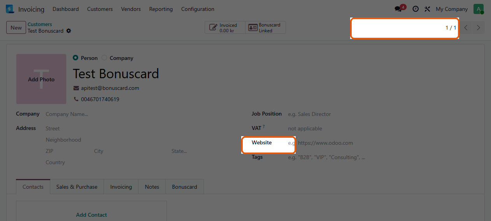
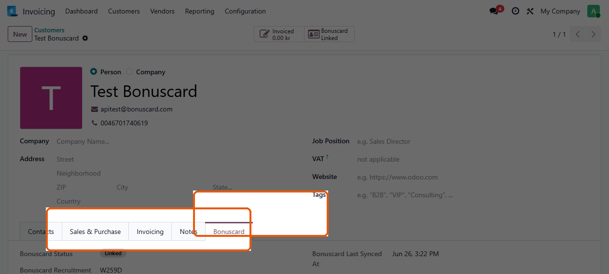

# Manager guide — Bonuscard

This guide is for **Bonuscard managers** (and administrators) who configure
the connection, product catalog, and customer links. Cashiers use a separate
guide: [POS cashier guide](pos-cashier.md).

Swedish version: [Administratörsguide](../sv/pos-admin.md)

## Before you start

- Your user is in the **Bonuscard Manager** group (or is an admin).
- You know the Bonuscard API base URL and credentials for your company.

## 1. Open Bonuscard connections

1. Open the app switcher and choose **Bonuscard**.
2. You land on **Connections**.

Create a connection with **New**, or open an existing row to edit it.

## 2. Configure and test the connection

On the connection form, set at least:

| Field | Purpose |
|-------|---------|
| **API Base URL** | Bonuscard API root (production or test). |
| **API Username** / **API Password** | Basic-auth credentials. |
| **API Culture** | Language/culture sent to the API. |
| **Use for Bonuscard API** | Mark the connection your company should use. |
| **Active** | Connection is available for use. |

Then click **Test Connection**. Status should become **OK** when credentials
and URL are valid.

Also on this form:

- **Run Bulk Prefetch** / **Refresh Bulk Prefetch** — preload partner
  Bonuscard links (reduces live lookups in POS).
- **Run Catalog Probe** — check products that are still **Not Set** against
  Bonuscard (managers only).

## 3. Bulk prefetch and catalog probe (optional)

Scroll the connection form for **Bulk Prefetch** and catalog probe settings.

Typical options:

- **Enable bulk partner prefetch** — daily job for partners never scanned.
- **TTL (hours)** / **batch size** — how often and how many partners per run.
- **Enable catalog probe** — scheduled checks for products with status
  **Not Set** (needs a **Catalog Probe Customer** identifier).

## 4. Mark products in the Bonuscard catalog

Only products marked **In Bonuscard Catalog** (with a barcode or internal
reference) are sent to Bonuscard from POS.

1. Go to **Inventory → Products → Products**.
2. Switch to **list** view if needed.

3. Select one or more products.
4. Open **Actions** and choose:

   - **Mark as Bonuscard Catalog**
   - **Mark as Not in Bonuscard Catalog**
   - **Reset Bonuscard Catalog Status**
   - **Check Bonuscard Catalog** (probe selected products)

Products without a barcode or article number cannot be marked as in catalog.

## 5. Review customer Bonuscard status

1. Open **Invoicing → Customers → Customers** (or Contacts, if installed).

2. Open a customer. The form shows a **Bonuscard** smart button (for example
   **Linked**) and a **Bonuscard** tab.

3. On the **Bonuscard** tab you can:

   - See status, recruitment code, last sync, and lookup notes
   - **Check Bonuscard** — force a fresh lookup
   - **Reset Bonuscard Status** — clear the link
   - **Register to Bonuscard** — when status is **not_found** (phone required)

## 6. POS discount product

In **Point of Sale → Configuration → Settings**, set a **Discount Product**.
Bonuscard discounts that cannot be applied as line percentages use this
product. Cashiers cannot fix this from the register.

## Quick checklist

1. Connection configured, **Use for Bonuscard API** set, **Test Connection** = OK.
2. Catalog products marked (and probed if you use catalog probe).
3. Important customers linked (or bulk prefetch enabled).
4. POS discount product configured.
5. Hand cashiers the [POS cashier guide](pos-cashier.md).

## Need help?

- Full configuration reference: [module README](../../../bonuscard_odoo/README.rst)
- Technical POS flow: [POS integration explanation](../../bonuscard_pos_integration_explanation.md)
